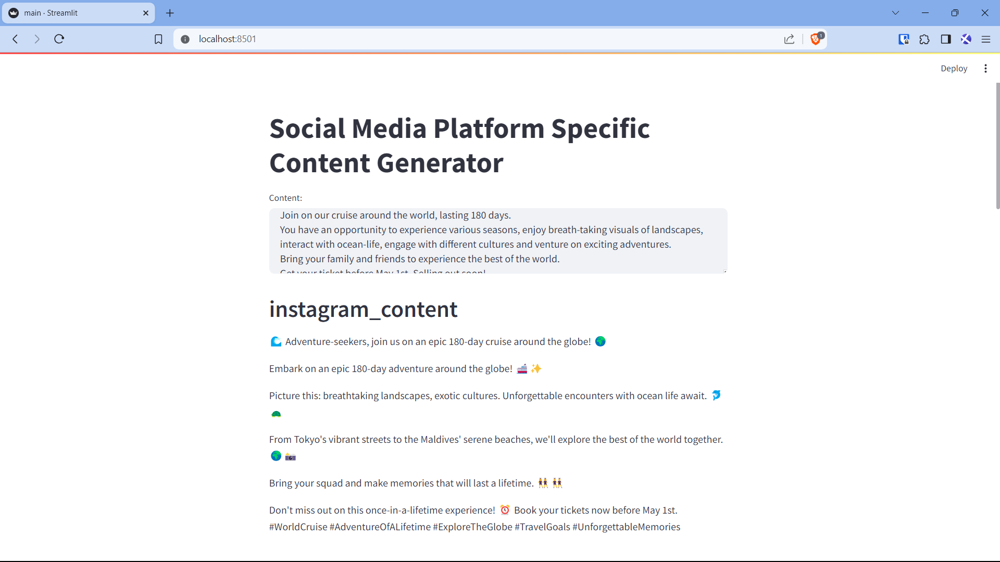

# Social Media Platform-Specific Content Editor

Paste one piece of content and get it rewritten for Instagram, TikTok and LinkedIn, each in that platform's style.

## How it works

A CrewAI pipeline per platform, run sequentially:

1. **Platform editor agent** (Instagram, TikTok or LinkedIn) rewrites the content for its platform.
2. **Content critic agent** reviews the draft and gives specific feedback.
3. **The editor rewrites** the draft using that feedback.

The three platform crews share one Gemini model through LangChain. A Streamlit page takes the input and shows each platform's final version.



More screenshots are in [`UI_Photos/`](UI_Photos/), sample outputs in [`example_allAgentOutputsComparison.txt`](example_allAgentOutputsComparison.txt) and [`example_InstagramAgentWithFeedback.txt`](example_InstagramAgentWithFeedback.txt), and a screen recording in [`Demo_socialmedia_content_editor.mkv`](Demo_socialmedia_content_editor.mkv).

## Run it

Requires Python 3.11 and a Gemini API key.

```bash
pip install -r requirements.txt
cp .env.example .env        # add your GOOGLE_GEMINI_API_KEY
streamlit run main.py
```

Set `GEMINI_MODEL` in `.env` to use a different Gemini model. Prompts to try are in [`example_prompts.txt`](example_prompts.txt).

## Stack

Python · CrewAI · LangChain · Google Gemini · Streamlit
