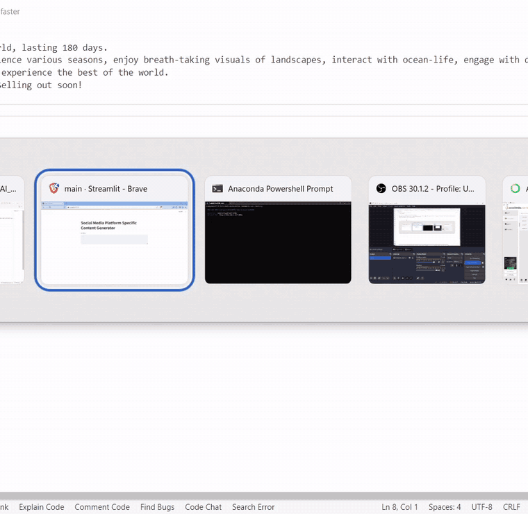
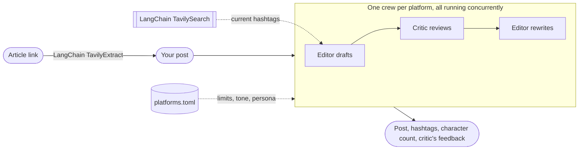

# Social Media Content Editor

Paste a post, or a link to an article, and get it rewritten for Instagram, TikTok and LinkedIn. For each platform, an editor agent writes a draft, a critic agent reviews it and the editor revises it. The three platforms run at the same time.



<sub>This recording shows the original 2024 version of the app. A [3.5-minute narrated walkthrough](docs/demo.mp4) is also available.</sub>

## How it works



- **One crew per platform.** Each [CrewAI](https://docs.crewai.com) crew runs three tasks in order: draft, critique and rewrite. The crews for all the platforms start together, using `asyncio.gather` over `Crew.akickoff`. If one platform fails, the others still return their posts.
- **Platform rules in one file.** [`platforms.toml`](src/social_editor/platforms.toml) holds each platform's character limit, hashtag limit, audience, tone and editor persona. To add a platform, add a section to that file.
- **LangChain for the web.** Two [langchain-tavily](https://pypi.org/project/langchain-tavily/) tools reach the web, both in [`web.py`](src/social_editor/web.py). `TavilyExtract` turns a pasted link into clean article text, so one blog post becomes three social posts. `TavilySearch` is given to each editor as a CrewAI tool for the draft step only, so it searches the past month for hashtags in current use instead of relying on ones it remembers. Both turn on when `TAVILY_API_KEY` is set (the free tier is enough).
- **Structured output.** Each task returns a Pydantic model. The app shows the final post with its hashtags, a character count checked against the platform's limit, and the critic's main points.
- **No invented facts.** Every prompt tells the agents to keep the original names, dates, prices and links and not to add new ones. The 2024 version made up a CEO quote for LinkedIn (see the results below).

## Quick start

You need [uv](https://docs.astral.sh/uv/) and a free [Gemini API key](https://aistudio.google.com/apikey).

```bash
git clone https://github.com/sriharish252/SocialMediaPlatformSpecificContentEditor && cd SocialMediaPlatformSpecificContentEditor
cp .env.example .env        # then add your GEMINI_API_KEY (and optionally TAVILY_API_KEY)
uv run social-editor        # the app opens at http://localhost:8501
```

**Other models:** the app uses `gemini/gemini-3.8-flash` by default. To change it, set `MODEL` to any `provider/model` string. Gemini and OpenAI models work as installed. For Anthropic, Groq, Ollama or any other provider that [LiteLLM](https://docs.litellm.ai/docs/providers) supports, first run `uv sync --extra providers`, then set that provider's API key.

**Tests:** run `uv run pytest`. The tests replace the LLM with a stub, so they need no API key or network access. The Tavily tools run for real, with only their HTTP calls replaced. The tests cover how the crews are wired, the platform limits, output parsing, concurrency, article loading, hashtag research and the Streamlit UI.

## Results

This is the 2024 version's output for the following post:

> Calling all creative minds! The MetalBoys, your one-stop shop for all things road bikes, is getting a brand new logo! We're on the hunt for talented artists to submit their designs for a chance to win a whopping $20,000 prize! Think you have what it takes? Head over to our website for details on how to submit your entry. Don't miss out on this exciting opportunity!

| Platform | After the editor → critic → rewrite loop |
| --- | --- |
| Instagram | Calling all creative minds! 🎨🚲 MetalBoys is getting a brand new logo, and we want YOU to design it! 🤘 Think you have what it takes? Head to our website for details on how to submit your entry. The winner gets a whopping $20,000! 💰 … Click the link in our bio to enter now! `#MetalBoysLogoContest #RoadBikes #DesignChallenge` |
| TikTok | Yo, check it! MetalBoys, the sickest road bike crew, is droppin' a new logo and they need your mad design skills! Submit your dope designs and you could win a fat $20k! Hit up their website for the deets. Don't sleep on this, fam! `#MetalBoysLogoChallenge #RideWithStyle` |
| LinkedIn | A long, formal announcement with a headline. It also included a made-up quote from "[MetalBoys representative's name], CEO of MetalBoys", a judging panel and a Q&A session, none of which were in the original post. The no-invented-facts rule now prevents this. |

## Stack

[CrewAI](https://docs.crewai.com) · [Gemini](https://ai.google.dev) (any provider through LiteLLM) · [LangChain](https://github.com/langchain-ai/langchain) + [Tavily](https://tavily.com) · [Streamlit](https://streamlit.io) · [Pydantic](https://docs.pydantic.dev) · [uv](https://docs.astral.sh/uv/) · [ruff](https://docs.astral.sh/ruff/) · [pytest](https://docs.pytest.org)
